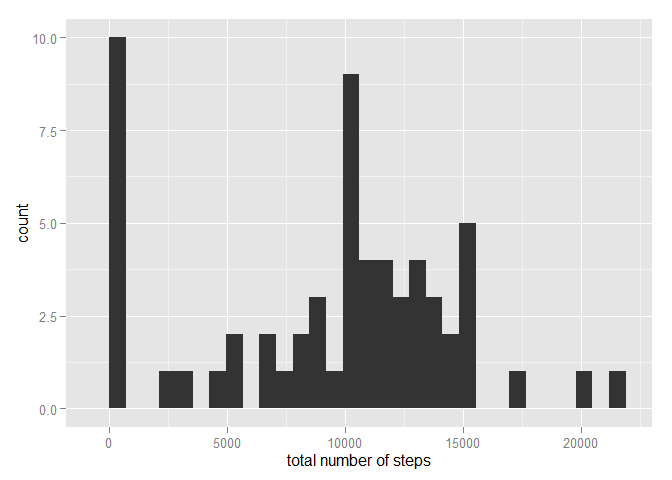
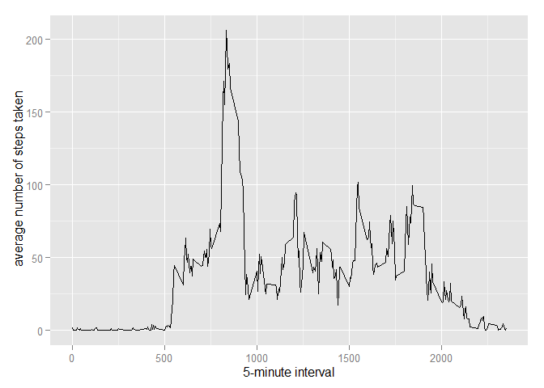
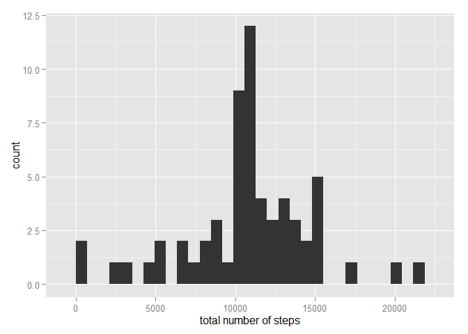
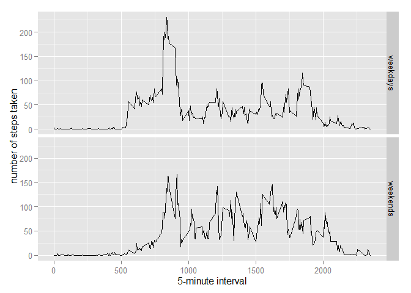

# Reproducible Research: Peer Assessment 1


```r
## Loading and preprocessing the data
setwd("D:/Reproducible research/RepData_PeerAssessment1")
unzip("./activity.zip")
data <- read.csv("./activity.csv",stringsAsFactors = FALSE, na.strings = NA)
data$date <- as.Date(data$date, "%Y-%m-%d")
Sys.setlocale("LC_TIME","English")
```

```
## [1] "English_United States.1252"
```

Histogram of the total number of steps taken each day


```r
## What is mean total number of steps taken per day?
stepsxday <- aggregate(data$steps,by= list(data$date), sum, na.rm= TRUE)
names(stepsxday) <- c("day","steps")

library(ggplot2)
ggplot(stepsxday,aes(steps))+geom_histogram()
```

 

Mean and median number of steps taken each day


```r
mean <- aggregate(data$steps,by= list(data$date), mean, na.rm= TRUE)
median <- aggregate(data$steps,by= list(data$date), median, na.rm= TRUE)$x
mean_median <- data.frame(mean,median); names(mean_median) <- c("date","mean","median")
mean_median
```

```
##          date       mean median
## 1  2012-10-01        NaN     NA
## 2  2012-10-02  0.4375000      0
## 3  2012-10-03 39.4166667      0
## 4  2012-10-04 42.0694444      0
## 5  2012-10-05 46.1597222      0
## 6  2012-10-06 53.5416667      0
## 7  2012-10-07 38.2465278      0
## 8  2012-10-08        NaN     NA
## 9  2012-10-09 44.4826389      0
## 10 2012-10-10 34.3750000      0
## 11 2012-10-11 35.7777778      0
## 12 2012-10-12 60.3541667      0
## 13 2012-10-13 43.1458333      0
## 14 2012-10-14 52.4236111      0
## 15 2012-10-15 35.2048611      0
## 16 2012-10-16 52.3750000      0
## 17 2012-10-17 46.7083333      0
## 18 2012-10-18 34.9166667      0
## 19 2012-10-19 41.0729167      0
## 20 2012-10-20 36.0937500      0
## 21 2012-10-21 30.6284722      0
## 22 2012-10-22 46.7361111      0
## 23 2012-10-23 30.9652778      0
## 24 2012-10-24 29.0104167      0
## 25 2012-10-25  8.6527778      0
## 26 2012-10-26 23.5347222      0
## 27 2012-10-27 35.1354167      0
## 28 2012-10-28 39.7847222      0
## 29 2012-10-29 17.4236111      0
## 30 2012-10-30 34.0937500      0
## 31 2012-10-31 53.5208333      0
## 32 2012-11-01        NaN     NA
## 33 2012-11-02 36.8055556      0
## 34 2012-11-03 36.7048611      0
## 35 2012-11-04        NaN     NA
## 36 2012-11-05 36.2465278      0
## 37 2012-11-06 28.9375000      0
## 38 2012-11-07 44.7326389      0
## 39 2012-11-08 11.1770833      0
## 40 2012-11-09        NaN     NA
## 41 2012-11-10        NaN     NA
## 42 2012-11-11 43.7777778      0
## 43 2012-11-12 37.3784722      0
## 44 2012-11-13 25.4722222      0
## 45 2012-11-14        NaN     NA
## 46 2012-11-15  0.1423611      0
## 47 2012-11-16 18.8923611      0
## 48 2012-11-17 49.7881944      0
## 49 2012-11-18 52.4652778      0
## 50 2012-11-19 30.6979167      0
## 51 2012-11-20 15.5277778      0
## 52 2012-11-21 44.3993056      0
## 53 2012-11-22 70.9270833      0
## 54 2012-11-23 73.5902778      0
## 55 2012-11-24 50.2708333      0
## 56 2012-11-25 41.0902778      0
## 57 2012-11-26 38.7569444      0
## 58 2012-11-27 47.3819444      0
## 59 2012-11-28 35.3576389      0
## 60 2012-11-29 24.4687500      0
## 61 2012-11-30        NaN     NA
```

Time series plot of the average number of steps taken


```r
## What is the average daily activity pattern?
stepsxinterval <- aggregate(data$steps,by= list(data$interval), mean, na.rm= TRUE)
names(stepsxinterval) <- c("interval","steps")

ggplot(stepsxinterval, aes(interval,steps))+ geom_line()+ labs(x="5-minute interval", y = " average number of steps taken")
```

 

The 5-minute interval that, on average, contains the maximum number of steps


```r
stepsxinterval$interval[stepsxinterval$steps==max(stepsxinterval$steps)]
```

```
## [1] 835
```

Code to describe and show a strategy for imputing missing data


```r
## Imputing missing values
steps1 <- data.frame()
for(i in seq_along(data$steps)) {
        if(is.na(data[i,1])) fill <- stepsxinterval$steps[stepsxinterval$interval ==data$interval[i]] else fill <- data[i,1]
        steps1 <- rbind(steps1,fill)
}
```

Histogram of the total number of steps taken each day after missing values are imputed


```r
data1 <- cbind(steps1,data[,2:3]); names(data1)[1]<- "steps"

stepsxday1 <- aggregate(data1$steps,by= list(data1$date), sum, na.rm= TRUE)
names(stepsxday1) <- c("day","steps")

ggplot(stepsxday1,aes(steps))+geom_histogram()
```

 

```r
mean <- aggregate(data1$steps,by= list(data1$date), mean, na.rm= TRUE)
median <- aggregate(data1$steps,by= list(data1$date), median, na.rm= TRUE)$x
mean_median <- data.frame(mean,median); names(mean_median) <- c("date","mean","median")
mean_median
```

```
##          date       mean   median
## 1  2012-10-01 37.3825996 34.11321
## 2  2012-10-02  0.4375000  0.00000
## 3  2012-10-03 39.4166667  0.00000
## 4  2012-10-04 42.0694444  0.00000
## 5  2012-10-05 46.1597222  0.00000
## 6  2012-10-06 53.5416667  0.00000
## 7  2012-10-07 38.2465278  0.00000
## 8  2012-10-08 37.3825996 34.11321
## 9  2012-10-09 44.4826389  0.00000
## 10 2012-10-10 34.3750000  0.00000
## 11 2012-10-11 35.7777778  0.00000
## 12 2012-10-12 60.3541667  0.00000
## 13 2012-10-13 43.1458333  0.00000
## 14 2012-10-14 52.4236111  0.00000
## 15 2012-10-15 35.2048611  0.00000
## 16 2012-10-16 52.3750000  0.00000
## 17 2012-10-17 46.7083333  0.00000
## 18 2012-10-18 34.9166667  0.00000
## 19 2012-10-19 41.0729167  0.00000
## 20 2012-10-20 36.0937500  0.00000
## 21 2012-10-21 30.6284722  0.00000
## 22 2012-10-22 46.7361111  0.00000
## 23 2012-10-23 30.9652778  0.00000
## 24 2012-10-24 29.0104167  0.00000
## 25 2012-10-25  8.6527778  0.00000
## 26 2012-10-26 23.5347222  0.00000
## 27 2012-10-27 35.1354167  0.00000
## 28 2012-10-28 39.7847222  0.00000
## 29 2012-10-29 17.4236111  0.00000
## 30 2012-10-30 34.0937500  0.00000
## 31 2012-10-31 53.5208333  0.00000
## 32 2012-11-01 37.3825996 34.11321
## 33 2012-11-02 36.8055556  0.00000
## 34 2012-11-03 36.7048611  0.00000
## 35 2012-11-04 37.3825996 34.11321
## 36 2012-11-05 36.2465278  0.00000
## 37 2012-11-06 28.9375000  0.00000
## 38 2012-11-07 44.7326389  0.00000
## 39 2012-11-08 11.1770833  0.00000
## 40 2012-11-09 37.3825996 34.11321
## 41 2012-11-10 37.3825996 34.11321
## 42 2012-11-11 43.7777778  0.00000
## 43 2012-11-12 37.3784722  0.00000
## 44 2012-11-13 25.4722222  0.00000
## 45 2012-11-14 37.3825996 34.11321
## 46 2012-11-15  0.1423611  0.00000
## 47 2012-11-16 18.8923611  0.00000
## 48 2012-11-17 49.7881944  0.00000
## 49 2012-11-18 52.4652778  0.00000
## 50 2012-11-19 30.6979167  0.00000
## 51 2012-11-20 15.5277778  0.00000
## 52 2012-11-21 44.3993056  0.00000
## 53 2012-11-22 70.9270833  0.00000
## 54 2012-11-23 73.5902778  0.00000
## 55 2012-11-24 50.2708333  0.00000
## 56 2012-11-25 41.0902778  0.00000
## 57 2012-11-26 38.7569444  0.00000
## 58 2012-11-27 47.3819444  0.00000
## 59 2012-11-28 35.3576389  0.00000
## 60 2012-11-29 24.4687500  0.00000
## 61 2012-11-30 37.3825996 34.11321
```

Panel plot comparing the average number of steps taken per 5-minute interval across weekdays and weekends


```r
## Are there differences in activity patterns between weekdays and weekends?
data1$weekday <- weekdays(data1$date)
typeday <- character()
for(i in seq_along(data1$steps)) {
        if(data1$weekday[i] %in% c("Saturday","Sunday") ) {
                fill <- "weekend"
                }  else fill <- "weekday"
        typeday <- rbind(typeday,fill)
}

data1$typeday <- typeday
ggplot(data1,aes(interval,steps))+geom_line()+ facet_grid(typeday~.)+ labs(x = "5-minute interval", y = "number of steps taken")
```

 
